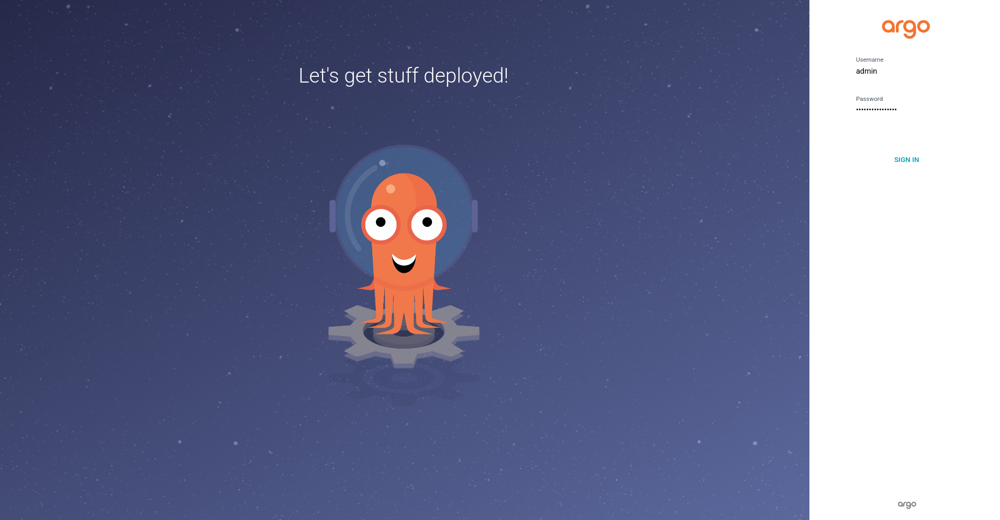
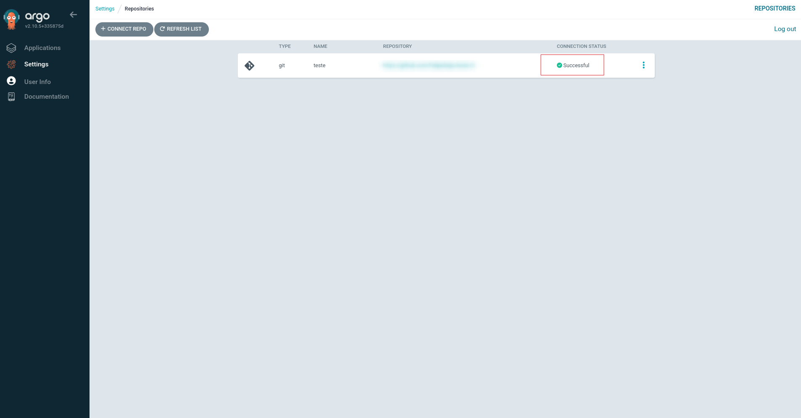
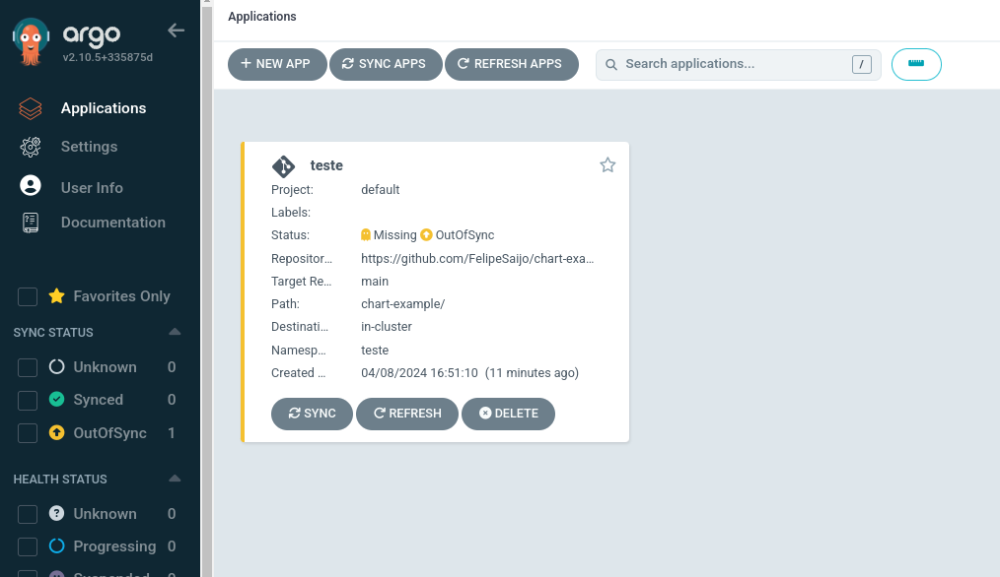
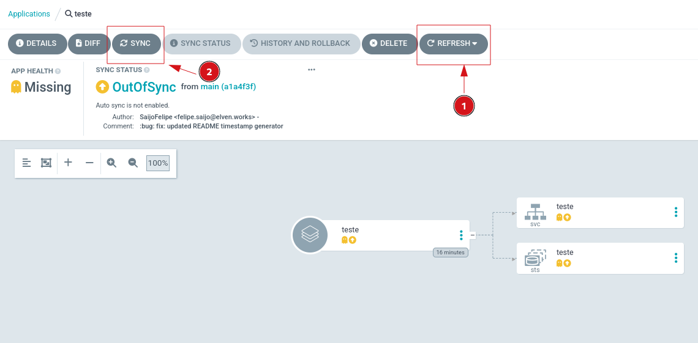
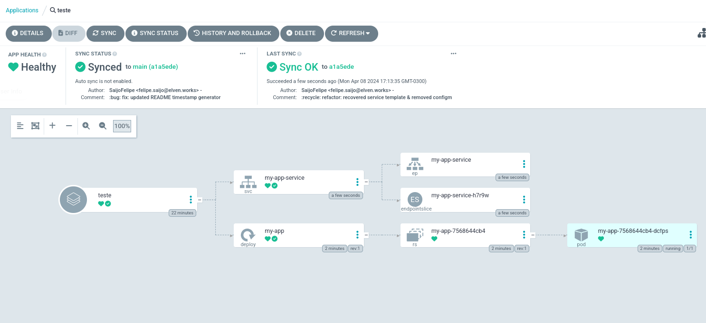

# ArgoCD Examples

O Propósito deste guia é instalar o ArgoCD e configurar uma aplicação com templates de exemplo para ajudar na compreensão do processo.

ArgoCD é uma ferramenta de GitOps que facilita o processo de deploy em clusters Kubernetes através de templates Kubernetes ou valores de Helm Chart.

## Dependencias

Para seguir com o guia será necessário ter as seguintes ferramentas instaladas:

- [kubectl](https://kubernetes.io/docs/tasks/tools/install-kubectl-linux/)
- [helm](https://helm.sh/docs/intro/install/)

## Instalação

- Caso deseje alterar alguma configuração padrão da instalação do ArgoCD use o seguinte comando para obter o arquivo de values:
``` bash
helm show values argo/argo-cd > argocd-values.yaml
```

- Use o seguinte comando para instalar o ArgoCD, caso tenha feito alguma alteração no arquivo de values passe a seguinte flag `-f argocd-values.yaml`:
``` bash
helm upgrade --install argocd argo/argo-cd -n argocd --create-namespace
```

- Para recuperar a senha gerada para o painel do ArgoCD execute o seguinte comando. Por padrão o usuario será `admin`:
``` bash
kubectl get secret argocd-initial-admin-secret -n argocd -o jsonpath="{.data.password}" | base64 -d
```

- Para acessar o painel execute o seguinte comando. Ele irá abrir um tunel do Service kubernetes para sua máquina em uma porta aleatoria:

``` bash
kubectl port-forward svc/argocd-server :80 -n argocd
```



## Secrets

- Use um dos arquivos no diretório `argocd-templates/secrets` para configurar o acesso do ArgoCD ao repositório. Você pode configurar a secret para cada repositório (arquivo `single-repo.yaml`) ou configurar uma vez as credenciais para os repositórios e apenas adicionar novas secrets para cada repositório (arquivo `multi-repos.yaml`), o ArgoCD consegue identificar a finalidade de cada secret através da label definida no template (Não modifique a label).

- Aplique a secret com o comando abaixo. Caso você tenha instalado o ArgoCD em outro namespace, atualize o campo com o namespace em que foi instalado. Ele deve estar no mesmo namespace para que o ArgoCD consiga reconhecer a secret.
``` bash
kubectl apply -f single-repo.yaml

OU

kubectl apply -f multi-repo.yaml
```

- No painel do ArgoCD, acesse `Settings -> Repositories` e verifique se o status da conexão com o repositório está marcado como Successful. Caso não esteja, valide se as credenciais configuradas têm acesso ao repositório ou as permissões do PAT (ou outro método que foi usado).



## Application

### Single Repository

- Altere os campos `<>` com os valores desejados no arquivo `argocd-templates/applications/application-k8s-files.yaml`. Caso não tenha sido configurada a secret, configure-a primeiro para que a Application consiga ler os arquivos.

`OBS.`: Caso esteja apontando para um arquivo de values de um Helm Chart, esse template exige que o arquivo de values esteja junto do Helm Chart. Para usar um arquivo de values com o Helm Chart separado, veja o próximo exemplo.

- Aplique o template após configurá-lo: 
``` bash
kubectl apply -f argocd-templates/applications/application-k8s-files.yaml
```

- Verifica no painel do ArgoCD em `Applications`, clique na Application criada.



- Caso você tenha feito alguma alteração nos templates clique em `Refresh` depois em `Sync -> Syncronize`. Após fazer a sincronização o ArgoCD irá aplicar o templates ou modificações dentro do cluster.



- Caso todos os recursos forem criados com sucesso, você verá o status de Sync e Health em verde. Se algum recurso não for criado, valide se o template está correto ou se o pod que está tentando ser criado não contém nenhum erro.


### Multiple Repository

- Em casos de você manter um helm chart separado do arquivo de values use o template `argocd-templates/applications/application-helm-chart.yaml` onde será necessário configurar o repositório para o chart e o repositório com o arquivo de values.

`OBS.`: Será necessário informar no arquivo o PAT para acessar o helm chart.

- Após configurar todos os campos aplique o template:
``` bash
kubectl apply -f argocd-templates/applications/application-helm-chart.yaml
```